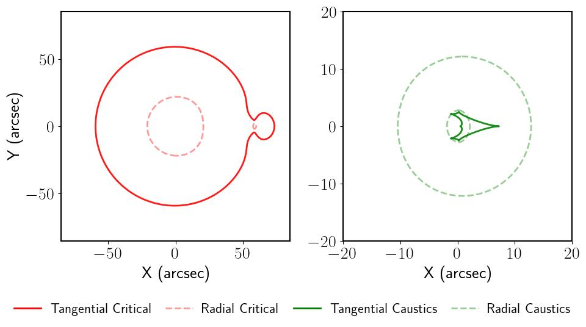

# A Universal Analytic Model for Gravitational Lensing by Self-Interacting Dark Matter Halos

[](https://arxiv.org/abs/2502.14964)

This code implements a **parametric model for gravitational lensing** by self-interacting dark matter (SIDM) halos. It extends the parametric framework introduced in arXiv:2305.16176 (JCAP), enabling more comprehensive lensing studies. The code allows for the analytic calculation of the lensing potential, deflection angle, and convergence (κ). It includes example scripts to compute critical curves and caustics for SIDM halos, both in isolation and within a main halo, and track their evolution through the gravothermal phase. For broader applicability, we also provide efficient FFT-based tools for numerically computing lensing signatures.

- **Authors**: Siyuan Hou, Daneng Yang, Nan Li, Guoliang Li



# File structure

- **example**
  - `example/Lensing.ipynb`: This Jupyter notebook provides instructions for using the parametric lensing model, along with examples of lensing-related maps, critical curves, and caustics. An example of the outcome is illustrated on this page.
  - `example/Accuracy.ipynb`: This Jupyter notebook computes the density and lensing-related profiles, comparing the model's predicted results with those obtained numerically.

- **lib**
  - `lib/Lensing_tool.py`: Contains utility functions for additional lensing-related calculations, such as finding critical curves and other lensing features.
  - `lib/SIDM_density_fluid.py`: Implements the density profile of SIDM halos.
  - `lib/SIDM_Parametric_Model_jax.py`:  The core parametric model for gravitational lensing by SIDM halos.
  - `lib/Processed_data`: This directory contains data for comparisons. 

---

# Requirements

This code uses **JAX**, a library for high-performance numerical computing, designed to accelerate calculations with automatic differentiation and GPU/TPU support. It allows for fast and scalable numerical operations in scientific computing.

- **Setting up JAX**: https://jax.readthedocs.io/en/latest/

- Packages:

```shell
pip install jupyter
pip install numpy
pip install matplotlib
pip install lenstronomy
pip install astropy
pip install sys
pip install pickle
pip install tqdm
pip install scipy
```
---

# Units: 

Mass: $\rm M_\odot/h$  
$r_{s,0}$:  $\rm Mpc/h$   
$\rho_{s,0}$:  $\rm h^2 M_\odot/Mpc^3$  

---

# References

Our code is free to copy and modify. If you find it useful, please cite the following papers. For any questions or comments, feel free to contact [syhou_at_pmo.ac.cn].

[1] S. Hou, D. Yang, N. Li, and G. Li, A Universal Analytic Model for Gravitational Lensing by Self-Interacting Dark Matter Halos, [arXiv:2502.14964](https://arxiv.org/abs/2502.14964). 

[2] D. Yang, E. O. Nadler, H.-B. Yu, and Y.-M. Zhong, A Parametric Model for Self-Interacting Dark Matter Halos, [J. Cosmol. Astropart. Phys. 2024, 032 (2024)](https://iopscience.iop.org/article/10.1088/1475-7516/2024/02/032).  

# Other related works

For more information on incorporating accretion history and baryon effects, please refer to the [GitHub page here](https://github.com/DanengYang/parametricSIDM).

[1] D. Yang, Exploring Self-Interacting Dark Matter Halos with Diverse Baryonic Distributions: A Parametric Approach, [Phys. Rev. D 110, 103044 (2024)](https://doi.org/10.1103/PhysRevD.110.103044)

[2] D. Yang, E. O. Nadler, H.-B. Yu, Testing the parametric model for self-interacting dark matter using matched halos in cosmological simulations, [Phys. Dark Universe 47, 101807 (2025)](https://doi.org/10.1016/j.dark.2025.101807)

[3] D. Yang, H.-B. Yu, Self-Interacting Dark Matter and Small-Scale Gravitational Lenses in Galaxy Clusters, [Phys. Rev. D 104, 103031](https://doi.org/10.1103/PhysRevD.104.103031)
